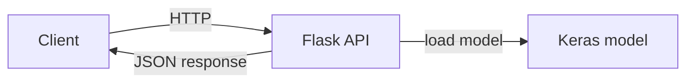

# COVID Image Classification API

A small Flask API that loads a TensorFlow/Keras model and returns a prediction for an uploaded image. The model is expected at `models/model_covid`.

## Diagram



## Features

- Flask-based API with a single entry point.
- Loads a pre-trained Keras model from `models/`.
- Returns JSON responses for GET/POST.

## Project Structure

```
Covid_api/
  server.py
  gunicorn_config.py
  models/
  templates/
  requirements.txt
  requirements.lock.txt
```

## Requirements

- Python 3.8+
- Pip packages in `requirements.txt`
- Optional: system dependencies for OpenCV (e.g., libgl)

## Setup

```bash
python3 -m venv venv
source venv/bin/activate
pip install -r requirements.txt
```

Place your trained model in:

```
models/model_covid
```

## Run

Development:

```bash
python server.py
```

Production (example):

```bash
gunicorn -c gunicorn_config.py server:app
```

## API Notes

- `GET /` returns a basic JSON response.
- `POST /` processes an image and returns a prediction.
- See `server.py` for the exact request format and handling.

## Requirements Notes

- `requirements.txt` contains the minimal runtime dependencies.
- `requirements.lock.txt` is the original environment snapshot.
